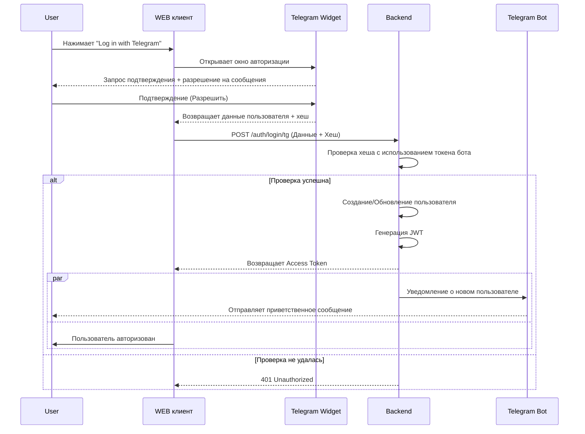

## Общий взгляд
Авторизация и регистрация будет использовать как источник только телеграмм. 
Авторизация и регистрация будет использовать механизм telegram login widget. ([официальная документация](https://core.telegram.org/widgets/login))
Процесс регистрации может начаться как в телеграмме, так и в web клиенте. 
Учетная запись пользователя является универсальной как для телеграмма, так и для web клиента.
Уникальность пользователя (т.е. существует ли он уже) определяется по telegram id. 
## Поток регистрации
### Авторизация или регистрация со стартовой точкой в web

| Акторы          | Пользователь, web клиент, tg bot, backend, telegram                                                                                                                                                                                                                                                                                                                                                                                                                                                                                                                                                                                                                                                                                      |
| --------------- | ---------------------------------------------------------------------------------------------------------------------------------------------------------------------------------------------------------------------------------------------------------------------------------------------------------------------------------------------------------------------------------------------------------------------------------------------------------------------------------------------------------------------------------------------------------------------------------------------------------------------------------------------------------------------------------------------------------------------------------------- |
| **Точка входа** | web клиент                                                                                                                                                                                                                                                                                                                                                                                                                                                                                                                                                                                                                                                                                                                               |
| **Триггер**     | Пользователь нажал кнопку "войти" на виджете                                                                                                                                                                                                                                                                                                                                                                                                                                                                                                                                                                                                                                                                                             |
| **Сценарий**    | 1. Виджет открывается во всплывающем окне и запрашивает разрешение пользователя на авторизацию через телеграмм; 2. Пользователь подтверждает запрос; 3. Виджет возвращает данные пользователя от телеграмма; 4. web формирует запрос к backend на создание нового пользователя или авторизацию; 5. backend подтверждает, что данного пользователя ещё не существует; 6. backend проверяет хэш чтобы убедиться, что данные получены от телеграмма. Проверка успешна; 7. backend создает нового пользователя; 8. backend отправляет уведомление о новом пользователе боту; 9. Бот отправляет приветственное сообщение; 10. backend отправляет токен авторизации на web клиент; 11. Пользователь авторизован. |
| Альт. сценарий  | 5.1 backend подтверждает, что пользователь уже существует; 6.1 backend отправляет токен авторизации; 7.1 пользователь авторизован.  6.1 backend проверяет хэш чтобы убедиться, что данные получены от телеграмма. Проверка **не** успешна; 6.2 backend возвращает ошибку 401; 6.3 web клиент отображает сообщение "что-то пошло не так, попробуйте позже"                                                                                                                                                                                                                                                                                                                                                              |

### Авторизация или регистрация со стартовой точкой в tg
| **Акторы**      | **пользователь, telegram, tg bot, backend**                                                                                                                                                                                                                                                                                                                                                                                |
| --------------- | -------------------------------------------------------------------------------------------------------------------------------------------------------------------------------------------------------------------------------------------------------------------------------------------------------------------------------------------------------------------------------------------------------------------------- |
| **Точка входа** | Telegram (мобильный или десктопный клиент)                                                                                                                                                                                                                                                                                                                                                                                 |
| **Триггер**     | Пользователь нажал **Start** или ввел команду `/start`.                                                                                                                                                                                                                                                                                                                                                                    |
| **Сценарий**    | 1. Пользователь открывает чат с ботом и нажимает кнопку "Start" или вводит /start. 2. Бот отправляет данные пользователя (tg_id, username, chat_id) на Backend. 3. Если tg_id не существует создается новая учетная запись. 4. Backend возвращает боту подтверждение об успешном создании/обновлении пользователя и токен. 5. Бот отправляет пользователю приветственное сообщение с ссылкой на web и токеном. |
|                 | 3.1 Если tg_id существует backend возвращает данные существующего пользователя.                                                                                                                                                                                                                                                                                                                                            |

## Модели данных для api endpoint

**Должны быть созданы следующие api endpoint:**
### Основной вход/регистрация: 

**Метод:** POST `/api/v1/auth/login/telegram` 
**Модель данных:**
[[Модели данных#to backend. Регистрация через web]]

### Обновление сессии

**Метод:** POST /api/v1/auth/refresh
Должен обновлять сессию пользователя путем выдачи нового jwt токена

### **Завершение сессии**

**Метод:** POST /api/v1/auth/logout 
Выход. Деактивирует Refresh Token на стороне Backend (из БД) и удаляет Cookie.

### Получение данных профиля пользователя

**Метод:** GET /api/v1/user/profile

### Регистрация через tg
**Метод:** POST /api/v1/auth/register/tg-start
**Модель данных:**
[[Модели данных#to backend. Регистрация через tg]]

