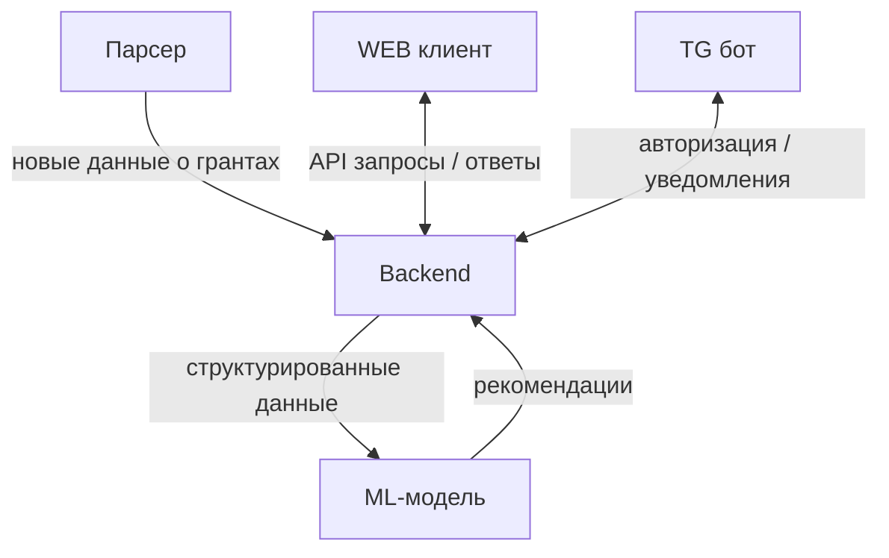
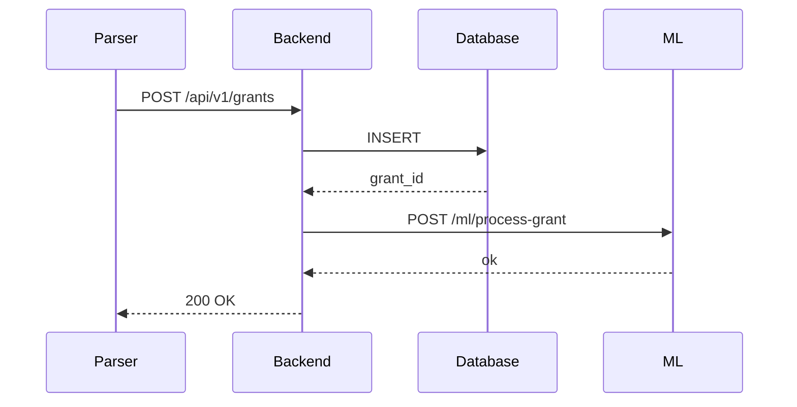

# Введение

## Назначение документа

Данный документ описывает начальные требования к разработке системы. Он не является конечной версией документации проекта и будет изменен. Здесь описана часть информации, которая позволит выполнить первичные задачи проекта и начать разработку.
## Термины и сокращения

Релевантный грант - грант, который рекомендован пользователю под конкретный запрос ml моделью.
## Цели текущей итерации

Инициализировать все основные компоненты системы на начальном этапе, создать git репозитории и оценить ресурсы затрачиваемые на разработку.

**Цели на текущую итерацию:**
1. Успешно реализовать полный цикл сбора и обработки грантов: от Парсера до записи в Базу Данных и векторизации в ML-модели.
2. Реализовать основной функционал Backend как связующего звена, включая API для Web-клиента, Telegram-бота и ML-модели.
3. Разработать дизайн макеты Web-клиента.
4. Создать Web-клиент и Telegram-бот как основные и дополнительные интерфейсы взаимодействия.
5. ML-МОДЕЛЬ
## Вопросы к созвону

1. Распределение ресурсов. Ульяна не должна сгореть. Что кому делать как можно ускорить разработку.
2. Качество документации и требований, устраивает ли текущий подход, что добавить. Один полную документацию я буду делать долго.
3. Дизайн и макеты. Нужно ли Рафу требования или ок! (блокирующая операция, невозможно взаимодействие с веб)
4. Архитектурные вопросы. Делать ли очередь?
5. Кто отвечает за сисиди?
6. Контроль и сроки
# Обзор архитектуры и взаимодействия

## Общий взгляд

Программный продукт представляет собой модульную инфраструктуру, элементы которой взаимодействуют друг с другом посредством API. Backend является центральным связующим звеном и основным хранилищем данных.

Общая схема компонентов

| Компонент  | Основная Функция                                                                                                       | Ответственный | Взаимодействие                                            |
| ---------- | ---------------------------------------------------------------------------------------------------------------------- | ------------- | --------------------------------------------------------- |
| Web-клиент | Основной интерфейс: регистрация, просмотр грантов (релевантных/избранных), настройки уведомлений.                      | Даниил        | Двустороннее с Backend через API.                         |
| Tg bot     | Дополнительный интерфейс: авторизация, уведомления о релевантных грантах9.                                             | Ульяна        | Двустороннее с Backend через API.                         |
| Парсер     | Сбор и нормализация информации о грантах из разных источников.                                                         | Ульяна        | Передает новые записи грантов в Backend через API.        |
| ML-модель  | Ядро рекомендательной системы. Обрабатывает гранты и запросы пользователей.                                            | Никита        | Вызывается Backend для рекомендаций. Хранит векторную БД. |
| Backend    | API, связующее звено, управление пользователями и аутентификацией, хранение данных, прием/валидация данных от Парсера. | Ульяна        | Основное хранилище данных; API для всех подсистем.        |
## Модели данных

### Backend Database

В этом разделе описаны сущности, которые хранятся в основной базе данных backend. Используется как источник истины, главное хранилище проекта.

#### Grant

Сущность описывающая грант. Поля формируются в трех компонентах:

Парсер - первичная обработка;

ML - анализ;

Backend - служебная информация.

Под client подразумевается tg bot и web. В дальнейшем может быть уточнено, какие конкретные данные какому типу клиента передаются.

|   |   |   |   |   |   |
|---|---|---|---|---|---|
|**Поле**|**Тип (БД)**|**Null**|**Описание**|**Формируется где**|**Использует**|
|**id**|serial|NO|Уникальный идентификатор записи|Backend (при вставке в БД)|Все|
|**source_name**|varchar(255)|NO|Название источника (сайт, агрегатор и т.д.)|Парсер|Backend, Client|
|**url**|text|NO|Ссылка на оригинал публикации|Парсер|Backend, Client|
|**published_at**|date|NO|Дата публикации источника|Парсер|Backend, Client|
|**title**|text|NO|Заголовок гранта|Парсер|ML, Backend, Client|
|**text_raw**|text|NO|Полный текст публикации (сырой, неочищенный)|Парсер|ML, Backend|
|**text_clean**|text|NO|Очищенный текст публикации (удалены html, лишние символы и т.п.)|Парсер|ML, Backend|
|**summary**|text|YES|Краткое описание, сгенерированное автоматически|Парсер|Backend, Web, Client|
|**amount_text**|varchar(255)|NO|Размер финансирования в текстовом виде|Парсер|Backend, Client|
|**amount_value**|numeric(15,2)|YES|Размер финансирования в числовом виде|Парсер (извлекает число из amountText)|ML, Backend, Client|
|**deadline_text**|varchar(255)|YES|Крайний срок подачи заявок (в текстовом виде)|Парсер|Backend, Client|
|**deadline_date**|date|YES|Крайний срок подачи заявок (в формате даты)|Парсер (конвертация из deadlineText)|Backend, Client|
|**layer**|varchar(255)|NO|Текущий слой (active_layer, archive_layer, template_layer)|Backend|Backend, Client|
|**apply_link**|text|YES|Ссылка на форму подачи заявки|Парсер|Web, Client|
|**tags**|text[]|YES|Массив тегов, выделенных из текста|Парсер|Backend, Client|
|**contact_email**|varchar(255)|YES|Почта для связи|Парсер|Backend, Client|
|**contact_phone**|varchar(64)|YES|Телефон для связи|Парсер|Backend, Client|
|**requirements**|text|YES|Требования к участникам (возраст, статус, резидентство и т.п.)|Парсер|Backend, Client|
|**organization**|varchar(255)|YES|Организатор гранта|Парсер|Backend, Client|
|**extra_data**|jsonb|YES|Неструктурированные дополнительные данные (всё, что не в основные поля)|Парсер или ML или Backend|Backend|
|**created_at**|timestamp|NO|Время добавления записи в БД|Backend|Backend|
#### User

Сущность описывающая пользователя зарегистрированного в системе.

| Поле                  | Тип (БД)     | Null             | Описание                                     |
| --------------------- | ------------ | ---------------- | -------------------------------------------- |
| id                    | serial       | NO               | Уникальный идентификатор пользователя        |
| tg_id                 | bigint       | YES              | Telegram ID, если есть                       |
| name                  | varchar(255) | YES              | Имя (по возможности из Telegram или профиля) |
| region                | varchar(255) | YES              | Регион пользователя                          |
| profile_text          | text         | YES              | Описание проекта                             |
| notifications_enabled | boolean      | NO, default true | Получает ли уведомления                      |
| created_at            | timestamp    | NO               | Когда создан профиль                         |
#### ml get grant

Сущность описывающая запрос для получения рекомендаций у ml модели для пользователя.

| **Поле**         | **Тип (json)** | **Тип (БД)** | **Null** | **Описание**                          |
| ---------------- | -------------- | ------------ | -------- | ------------------------------------- |
| **id**           | string         | serial       | NO       | Уникальный идентификатор пользователя |
| **profile_text** | string         | text         | NO       | Описание проекта                      |
### Парсер

#### Parser Grant

Сущность гранта, которая передает парсером в backend.

|                   |                |               |          |                                                                  |
| ----------------- | -------------- | ------------- | -------- | ---------------------------------------------------------------- |
| **Поле**          | **Тип (json)** | **Тип (БД)**  | **Null** | **Описание**                                                     |
| **source_name**   | string         | varchar(255)  | NO       | Название источника (сайт, агрегатор и т.д.)                      |
| **url**           | string         | text          | NO       | Ссылка на оригинал публикации                                    |
| **published_at**  | string         | date          | NO       | Дата публикации источника                                        |
| **title**         | string         | text          | NO       | Заголовок гранта                                                 |
| **text_raw**      | string         | text          | NO       | Полный текст публикации (сырой, неочищенный)                     |
| **text_clean**    | string         | text          | NO       | Очищенный текст публикации (удалены html, лишние символы и т.п.) |
| **summary**       | string         | text          | YES      | Краткое описание, сгенерированное автоматически                  |
| **amount_text**   | string         | varchar(255)  | NO       | Размер финансирования в текстовом виде                           |
| **amount_value**  | number (float) | numeric(15,2) | YES      | Размер финансирования в числовом виде                            |
| **deadline_text** | string         | varchar(255)  | NO       | Крайний срок подачи заявок (в текстовом виде)                    |
| **deadline_date** | string         | date          | NO       | Крайний срок подачи заявок (в формате даты)                      |
| **apply_link**    | string         | text          | YES      | Ссылка на форму подачи заявки                                    |
| **tags**          | array<string>  | text[]        | YES      | Массив тегов, выделенных из текста                               |
| **contact_email** | string         | varchar(255)  | YES      | Почта для связи                                                  |
| **contact_phone** | string         | varchar(64)   | YES      | Телефон для связи                                                |
| **requirements**  | string         | text          | YES      | Требования к участникам (возраст, статус, резидентство и т.п.)   |
| **organization**  | string         | varchar(255)  | YES      | Организатор гранта                                               |

#### Recomended grant

На данном этапе используем полную модель из бд [Grant](https://rtf-wizards.atlassian.net/wiki/spaces/grandgrant/pages/10158091#Grant). Уточнения будут после согласования дизайна.

### Web

#### User get grant

|   |   |   |   |   |
|---|---|---|---|---|
|**Поле**|**Тип (json)**|**Тип (БД)**|**Null**|**Описание**|
|**user_id**|string|serial|NO|Уникальный идентификатор пользователя|

### ML

#### Recomended grant score

|   |   |   |   |   |
|---|---|---|---|---|
|**Поле**|**Тип (json)**|**Тип (БД)**|**Null**|**Описание**|
|**grant_id**|string|serial|NO|Уникальный идентификатор гранта|
|**user_id**|string|serial|NO|Уникальный идентификатор пользователя|
|**relevance_score**|number (float)|double precision|NO|степень релевантности (0.0 - 1.0)|

## Взаимодействие компонентов

### Основные сценарии

#### Добавление новых грантов

**!!ВАЖНО!!:** уточнить, будем ли использовать очередь или просто пост запрос к ml

**Инициатор**: Парсер. Процесс выполняется периодически по таймеру.

**Результат:** В базу сохранены новые данные. В ml сохранены новые данные.

**Участники:** Парсер, backend.

**Сценарий:**

1. Парсер начинает сбор по таймеру
    
2. Парсер собирает данные из источников
    
3. Парсер нормализует данные
    
4. Парсер отправляет post запрос /api/v1/grants используя модель данных [Parser Grant](https://rtf-wizards.atlassian.net/wiki/spaces/grandgrant/pages/edit-v2/10158091#Parser-Grant).
    
5. backend проверяет корректность объектов
    
6. backend добавляет служебную информацию и сохраняет в бд сущность [Grant](https://rtf-wizards.atlassian.net/wiki/spaces/grandgrant/pages/edit-v2/10158091#Grant).
    
7. backend отправляет данные ML /ml/process-grant.
    
8. ML сохраняет данные.

#### Получение рекомендаций

**Инициатор:** Пользователь через web клиент.

**Результат:** Пользователю отображен список рекомендуемых грантов.

**Участники:** web, backend, ml.

**Предусловия:** пользователь авторизован, введено описание проекта.

**Сценарий:**

1. Пользователь переходит на страницу релевантных грантов
2. Web отправляет get /api/v1/recommendations запрос на backend используя модель данных [user get grant](https://rtf-wizards.atlassian.net/wiki/spaces/grandgrant/pages/10158091#User-get-grant).
    
3. Backend отправляет запрос /ml/recommend используя модель данных [ml get grant](https://rtf-wizards.atlassian.net/wiki/spaces/grandgrant/pages/10158091#ml-get-grant).
    
4. Ml формирует список рекомендаций.
    
5. Ml возвращает на backend список рекомендаций согласно модели [recomended grant score](https://rtf-wizards.atlassian.net/wiki/spaces/grandgrant/pages/10158091#Recomended-grant-score).
    
6. Backend возвращает список рекомендованных грантов согласно модели [Recomended grant](https://rtf-wizards.atlassian.net/wiki/spaces/grandgrant/pages/10158091#Recomended-grant).
    
7. Web отображает рекомендованные гранты.